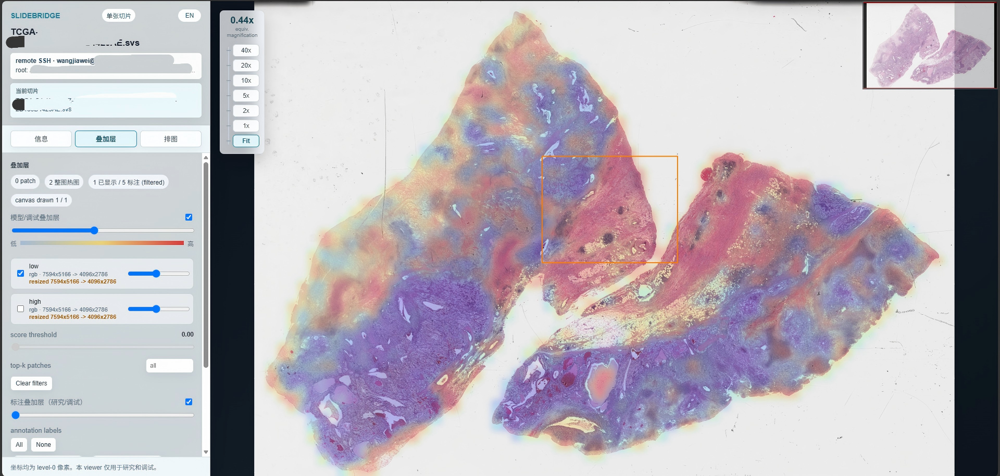
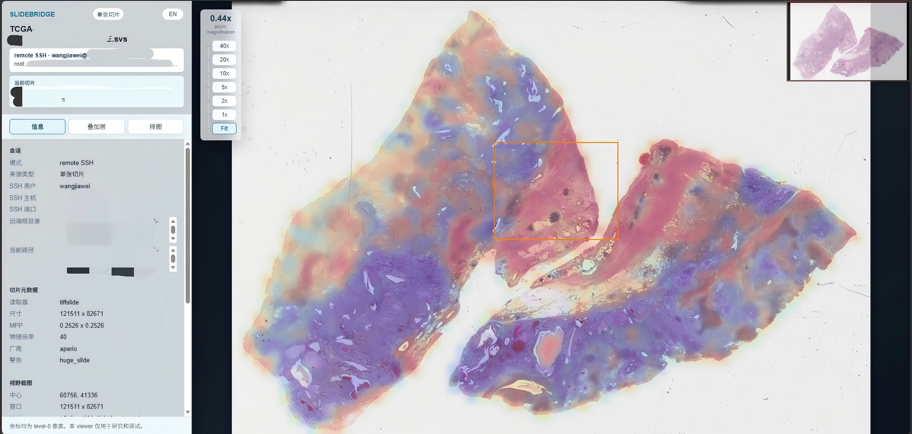
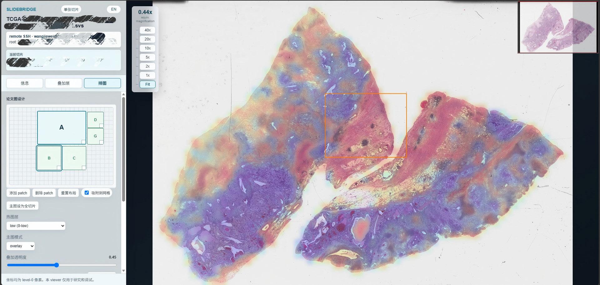

# SlideBridge Core

[](https://github.com/WangjiaweiY/slidebridge/actions/workflows/ci.yml)


[中文 README](README.md)

SlideBridge Core is a WSI inspection, model-output debugging, and publication-figure design toolkit for computational pathology and pathology AI. Its main entry point is a browser workflow for remote slide viewing, heatmap/annotation/patch debugging, and reproducible figure export.

Current version: `0.3.0`



> Coordinates are level-0 pixel coordinates. SlideBridge is for research and algorithm debugging only; it is not for clinical diagnosis.

## Highlights

- **Remote slides, local browser.** Open WSI files stored on a server through SSH, without downloading huge slides to your workstation.
- **Browse a cohort by folder.** Open a remote directory in the viewer and choose slides from the folder, which fits daily pathology AI dataset and model-output review.
- **Inspect heatmaps on top of the slide.** Overlay model heatmaps with the original WSI to check attention, risk regions, segmentation outputs, or other model responses.
- **See annotations and patches in context.** Overlay patches, scores, and manual or algorithmic annotations to catch coordinate shifts, scale mistakes, and sampling problems.
- **Design paper figures in the browser.** Arrange a main slide view and patch panels, then export a high-resolution PNG rendered from level-0 coordinates instead of a browser screenshot.

## Install

SlideBridge needs a **local installation** to start the Web App and create the SSH tunnel. To view WSI files stored on a server, the remote server also needs a Python environment that can run SlideBridge and read the slides.

### Local Install

Install from GitHub into the current Python/Conda environment:

```powershell
pip install git+https://github.com/WangjiaweiY/slidebridge.git
```

Development install:

```powershell
git clone https://github.com/WangjiaweiY/slidebridge.git
cd slidebridge
pip install -e .[dev]
```

Check the installed version. If the terminal can find `slidebridge`:

```cmd
slidebridge version
```

If your terminal cannot find `slidebridge`, use the Python module form:

```cmd
python -m slidebridge.cli version
```

Windows / Anaconda users can also call the environment executable directly. Replace the path below with your own Conda environment path:

```powershell
C:\path\to\conda\envs\slidebridge\Scripts\slidebridge.exe version
```

### Remote Environment

For remote WSI viewing, install SlideBridge on the server too. A common setup is a Conda environment:

```bash
conda create -n slidebridge python=3.11 -y
conda activate slidebridge
pip install git+https://github.com/WangjiaweiY/slidebridge.git
```

If the remote shell cannot find `conda`, that is fine. In the Web App launcher, enter the remote environment path, for example:

```text
/home/user/miniconda3/envs/slidebridge
```

SlideBridge will use:

```text
/home/user/miniconda3/envs/slidebridge/bin/python -m slidebridge.cli
```

## Start The Web App

The recommended v0.3.0 entry point is the Web App:

```cmd
slidebridge app
```

If the `slidebridge` command is unavailable:

```cmd
python -m slidebridge.cli app
```

Windows / Anaconda users can call the environment executable directly:

```powershell
C:\path\to\conda\envs\slidebridge\Scripts\slidebridge.exe app
```

The launcher configures SSH and the remote Python/Conda runtime. It only handles the remote connection and viewer startup; slide directories, heatmaps, patches, and annotations are selected inside the viewer.

## Browser Workflow

1. Fill in SSH host, user, and port in the launcher, then test the connection.
2. Select the remote runtime. For Conda, enter the environment path, for example `/home/user/miniconda3/envs/slidebridge`; SlideBridge must already be installed in that remote environment.
3. Click the launch button. The launcher waits for the remote viewer API and then opens the viewer.
4. In the viewer Files/Data tab, open a remote directory or type a target directory path.
5. Select a slide, then add heatmaps, patch coordinates, or annotation files for that slide.
6. Use the Figure tab to arrange a paper/presentation figure and export PNG.

SSH keys, `ssh-agent`, `~/.ssh/config` aliases, and password login are handled by your local `ssh` client. If the server requires a password, the prompt appears in the terminal that started `slidebridge app`.



## Heatmaps, Annotations, And Patches

The viewer supports multiple model heatmaps on the same slide. Each heatmap can be shown, hidden, opacity-adjusted, or removed. Patch locations and annotations help check whether model outputs, sampling coordinates, and manual or algorithmic annotations are aligned to the WSI.

Public annotation inputs include QuPath GeoJSON, ASAP XML, and SlideBridge JSON. See:

- [Annotation formats](docs/ANNOTATION_FORMATS.md)
- [Coordinates](docs/COORDINATES.md)
- [Heatmaps](docs/HEATMAPS.md)

## Figure Designer

The Figure Designer lets users arrange a main panel and patch panels in the browser. Exported PNGs are not browser screenshots; the backend re-reads the slide and renders the figure from the level-0 coordinates stored in the figure spec.



See [Figure Designer docs](docs/FIGURES.md) for details.

## Command Line Usage

This README focuses on the recommended web workflow. For `remote-view`, `view`, `render-view`, `render-figure`, `export-patches`, and annotation/patch/heatmap debugging commands, see the [CLI reference](docs/CLI.md).

## Important Notice

- Research and algorithm development only.
- Not for clinical diagnosis.
- This project does not include proprietary vendor SDKs.
- This project does not implement proprietary vendor readers.
- Vendor-specific readers should be integrated only through separately licensed private plugins.
- This project is not affiliated with, endorsed by, or certified by any scanner vendor.
