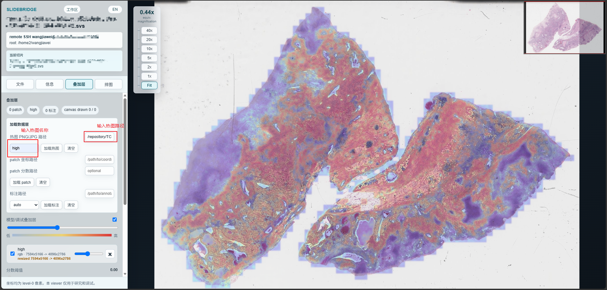
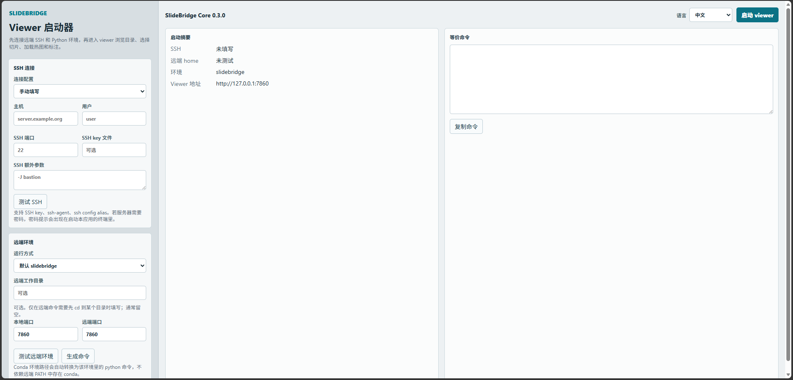
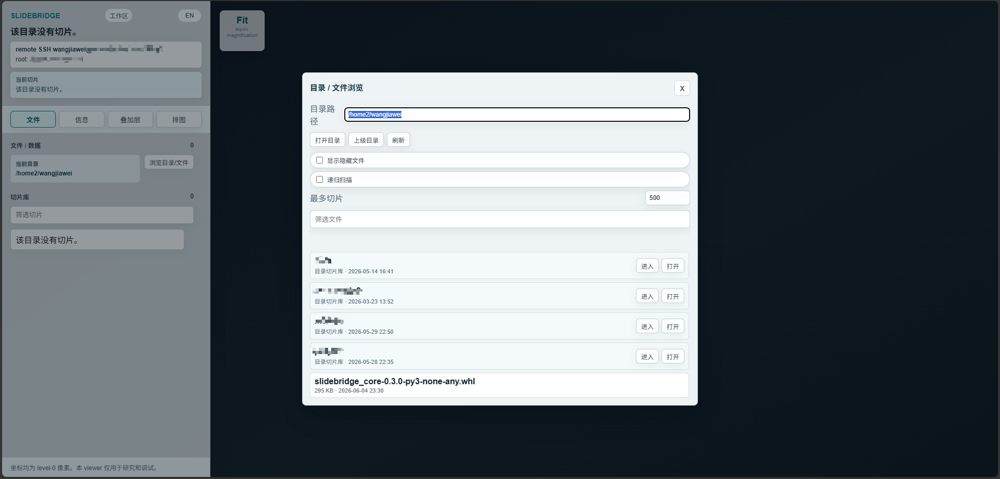
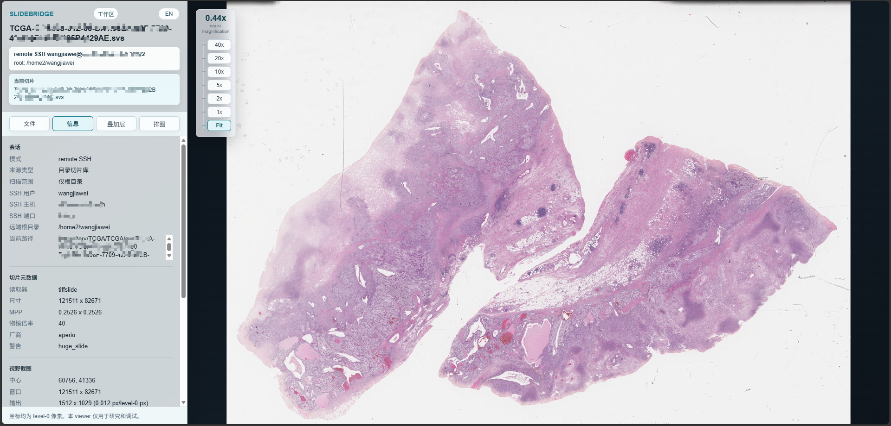
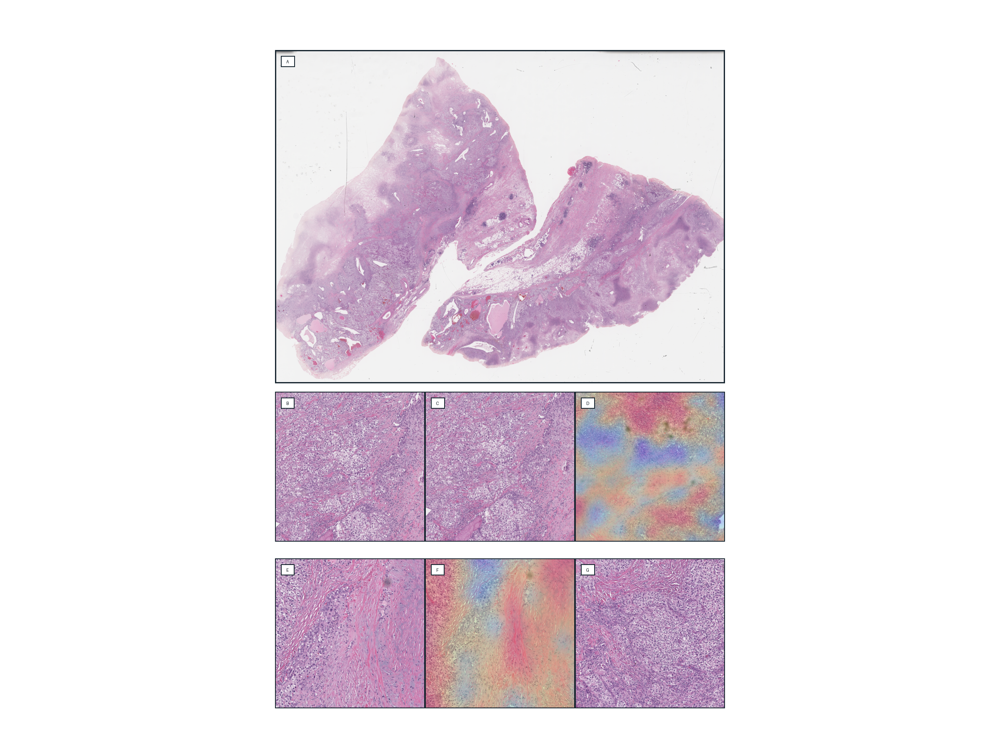
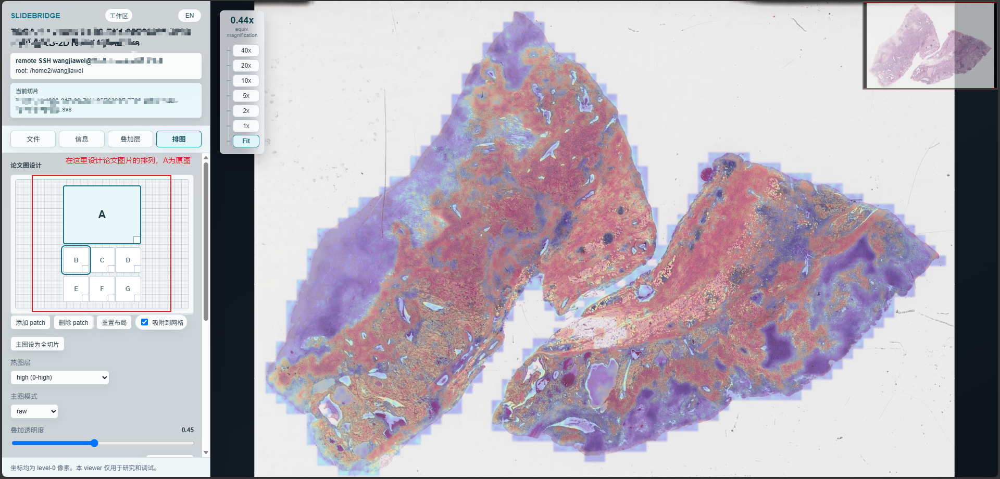
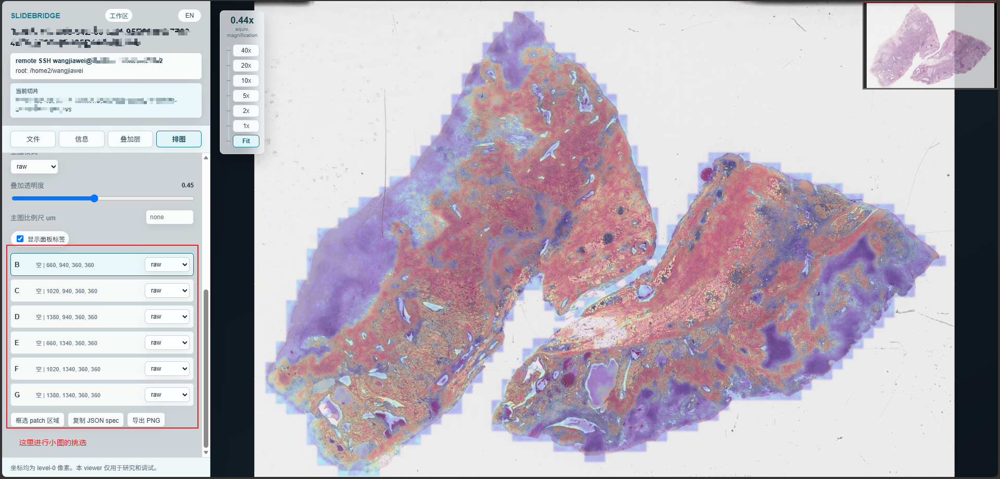

# SlideBridge Core

[](https://github.com/WangjiaweiY/slidebridge/actions/workflows/ci.yml)


[English README](README.en.md)

SlideBridge Core 是一个面向计算病理和病理 AI 的 WSI inspection、model-output debugging 和论文图设计工具箱。它的核心目标是让研究者在浏览器里完成远端切片浏览、热图/标注/patch 调试，以及可复现的论文图导出。

当前版本：`0.3.1`



> 坐标均为 level-0 像素坐标。本项目仅用于 research 和 algorithm debugging，不用于 clinical diagnosis。

## 主要能力

- **远端切片，本地直接看。** 通过 SSH 在本地浏览器打开服务器上的 WSI，不需要把大切片下载到电脑上。
- **按文件夹浏览 cohort。** 在网页里打开远端目录，直接选择该目录下的切片，适合病理 AI 日常查看数据集和模型结果。
- **热图和原图放在一起检查。** 在同一个 viewer 里叠加模型热图，快速判断注意力、风险区域或分割结果是否合理。
- **标注和 patch 坐标一眼对齐。** 把 patch、score、人工/算法标注叠到 WSI 上，定位坐标错位、尺度错误和采样问题。
- **在网页里排论文图。** 拖动主图和多个 patch 小图，导出时由后端按 level-0 坐标重新渲染高分辨率 PNG，而不是浏览器截图。

## 安装

SlideBridge 需要在**本地电脑**安装一次，用来启动 Web App 和建立 SSH tunnel。远端服务器上也需要有一个能运行 SlideBridge 的 Python 环境，用来读取服务器上的 WSI。

### 本地安装

如果是全新的 Conda 环境，推荐先建环境再安装：

```powershell
conda create -n slidebridge python=3.11 -y
conda activate slidebridge
pip install git+https://github.com/WangjiaweiY/slidebridge.git
```

也可以直接安装到当前 Python/Conda 环境：

```powershell
pip install git+https://github.com/WangjiaweiY/slidebridge.git
```

如果当前机器无法稳定访问 GitHub，也可以从 [GitHub Releases](https://github.com/WangjiaweiY/slidebridge/releases) 下载 wheel 文件，然后在本地或传到服务器后安装：

```bash
pip install slidebridge_core-0.3.1-py3-none-any.whl
```

这会安装 Web App 需要的 Python 依赖，例如 FastAPI、Uvicorn、Pillow、NumPy、Pandas、OpenSlide Python binding 和 TiffSlide。Windows 上会同时安装 `openslide-bin`。Linux/macOS 如果需要在该环境里直接读取 WSI，且环境里还没有可用的 OpenSlide 或其他 WSI 读取底层库，通常还需要安装 OpenSlide；Conda 用户可以使用：

```bash
conda install -c conda-forge openslide -y
```

开发安装：

```powershell
git clone https://github.com/WangjiaweiY/slidebridge.git
cd slidebridge
pip install -e .[dev]
```

安装后检查版本。如果当前终端能找到 `slidebridge`：

```cmd
slidebridge version
```

如果终端找不到 `slidebridge`，可以使用 Python module 形式：

```cmd
python -m slidebridge.cli version
```

Windows / Anaconda 用户也可以直接调用环境里的 `slidebridge.exe`。把下面路径换成自己的 Conda 环境路径：

```powershell
C:\path\to\conda\envs\slidebridge\Scripts\slidebridge.exe version
```

### 远端环境

如果要浏览服务器上的 WSI，远端服务器也需要安装 SlideBridge。常见做法是在服务器上建一个 Conda 环境：

```bash
conda create -n slidebridge python=3.11 -y
conda activate slidebridge
conda install -c conda-forge openslide -y
pip install git+https://github.com/WangjiaweiY/slidebridge.git
```

远端环境要能完成两件事：运行 `python -m slidebridge.cli`，并且能读取服务器上的 WSI。对于 Linux 服务器，`openslide-python` 只是 Python binding；如果远端环境已经有可用的 OpenSlide 或其他 WSI 读取底层库，可以跳过 `conda install -c conda-forge openslide -y`。没有可用读取库时，网页启动器可能能打开，但选择 `.svs` 等切片时会报 reader 或 shared library 相关错误。

如果服务器无法稳定访问 GitHub，可以先在本地下载 release wheel，再上传到服务器安装：

```bash
pip install slidebridge_core-0.3.1-py3-none-any.whl
```

如果远端 shell 找不到 `conda`，也没关系。网页启动器可以直接填写远端环境路径，例如：

```text
/home/user/miniconda3/envs/slidebridge
```

SlideBridge 会使用该目录下的：

```text
/home/user/miniconda3/envs/slidebridge/bin/python -m slidebridge.cli
```

## 启动网页应用

SlideBridge v0.3.1 的推荐入口是 Web App：

```cmd
slidebridge app
```

如果 `slidebridge` 命令不可用：

```cmd
python -m slidebridge.cli app
```

Windows / Anaconda 用户可以直接使用环境里的可执行文件：

```powershell
C:\path\to\conda\envs\slidebridge\Scripts\slidebridge.exe app
```

打开后先在网页启动器里配置 SSH 和远端 Python/Conda runtime。启动器只负责连接远端和启动 viewer；切片目录、热图、patch 和 annotation 都在 viewer 里选择。

## 网页工作流

1. 在启动器中填写 SSH host、user、port，并测试连接。
2. 选择远端运行环境。Conda 用户推荐填写环境路径，例如 `/home/user/miniconda3/envs/slidebridge`；远端环境里需要已经安装 SlideBridge。
3. 点击启动 viewer。启动器会等待远端 viewer API 就绪，然后自动进入 viewer 页面。
4. 在 viewer 左侧“文件/数据”页打开远端目录，也可以直接输入目标目录路径。
5. 选择切片后，再添加热图、patch 坐标或标注文件。
6. 进入“排图”页，在浏览器里设计论文图布局，并导出 PNG。

SSH key、`ssh-agent`、`~/.ssh/config` alias 和密码登录都由本机 `ssh` 客户端处理。如果服务器要求密码，密码提示会出现在启动 `slidebridge app` 的终端里。



启动 viewer 后，可以在网页里打开远端目录。目录浏览器支持直接输入路径、返回上级目录、刷新、筛选文件，以及控制是否显示隐藏文件。



选中切片后，viewer 会直接显示服务器上的 WSI。切片仍然留在远端，本地浏览器只通过 SSH tunnel 访问 viewer。



## 热图、标注和 patch

Viewer 支持在同一张切片上叠加多张模型热图。每张热图都可以单独显示、隐藏、调透明度或移除。patch 位置和标注主要用于检查模型输出、采样坐标和人工/算法标注是否与 WSI 对齐。


支持 QuPath GeoJSON、ASAP XML 和 SlideBridge JSON。更多格式和坐标说明见：

- [Annotation formats](docs/ANNOTATION_FORMATS.md)
- [Coordinates](docs/COORDINATES.md)
- [Heatmaps](docs/HEATMAPS.md)

## 论文图设计

Figure Designer 允许在网页里自由摆放主图和 patch panels。导出时不会截取浏览器画面，而是由后端按 spec 里的 level-0 坐标重新读取切片并渲染 PNG，因此更适合论文和汇报图复现。



设计时可以先把当前视野设为主图，然后在左侧预览画布里拖动和缩放 A/main 与 B-G patch 面板。布局只是设计预览；真正导出时由后端重新渲染。



随后选择每个 patch 框对应的切片区域，可以分别使用原图或热图叠加效果，最后复制 JSON spec 或导出 PNG。



更多说明见 [Figure Designer docs](docs/FIGURES.md)。

## 命令行用法

README 只展示推荐的网页使用方式。如果需要 `remote-view`、`view`、`render-view`、`render-figure`、`export-patches`、annotation/patch/heatmap debugging 等命令行用法，请查看 [CLI reference](docs/CLI.md)。

## 重要声明

- 仅用于 research 和 algorithm development。
- 不用于 clinical diagnosis。
- 本项目不包含任何厂商私有 SDK。
- 本项目不实现任何私有厂商 reader。
- 特定 reader 应在单独授权的私有插件中实现。
- 本项目不隶属于、不代表、不背书任何扫描仪厂商。
